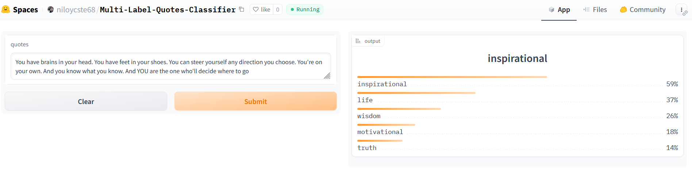
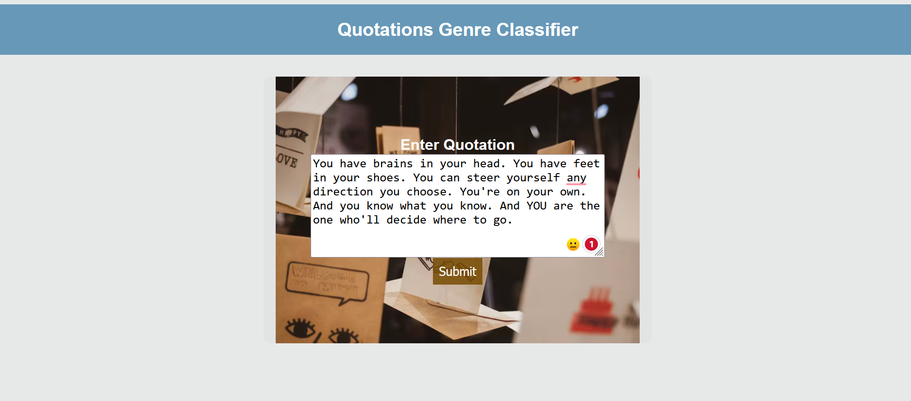
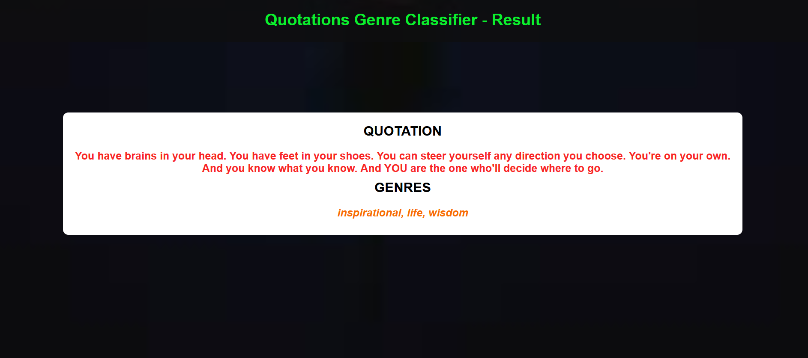

# MultiLabel-Quotes-Classifier 

## Objective
This project presents an end-to-end text classification system covering data collection, model training, and deployment. The model is designed to classify 138 distinct quotation genres. For a comprehensive list of identified quote genres, please refer to the keys in `deployment\tag_types_encoded.json`.

## Data Collection
The dataset used for training this model was obtained by scraping quotes from the [Goodreads website](https://www.goodreads.com/quotes) using the Selenium web automation tool. The data includes quotes from various genres such as:

- Love Quotes
- Life Quotes
- Inspirational Quotes
- Humor Quotes
- Philosophy Quotes
- Inspirational Quotes Quotes
- God Quotes
- Truth Quotes
- Wisdom Quotes
- Romance Quotes
- Poetry Quotes
- Death Quotes
- Happiness Quotes
- Hope Quotes
- Faith Quotes
- Success Quotes
-Life Quotes Quotes 
-Time Quotes 
-Motivation Quotes etc.

In total, approximately 38,611 quotes were collected. The dataset consists of three main columns: author name, quotation text, and genres. the data are stored in **`Dataset/dataquotes.csv`**.Anyone can access the dataset from [here](Dataset)

## Data Preprocessing
At first, there were 23,415 different kinds of genres in the dataset. After looking closely, I noticed many of them were rare, so I got rid of those uncommon ones. In the end, I settled on 138 genres. Also, I removed some quotes that didn't have any genre assigned, leaving me with a total of 38,607 data points.The preprocessing can be found in **`Notebook/NLP_Multilabel_Classification.ipynb`**.

## Model Training
I use a **`distilrobera-base`** model for finetuning from HuggingFace Transformers using Fastai and Blurr. The training happened in three stages, and I picked the best model with an accuracy of **97.8%** for deployment. You can check out the notebook for training [here](Notebook).
## Model Compression and ONNX Inference
The trained model takes up 313 MB of memory. I managed to shrink it down to around 78 MB by compressing it using ONNX quantization. You can check out the smaller file from 
[here](book-classifier-quantized.onnx) and you can access the main trained model using this [link](https://drive.google.com/file/d/1csI9EcKei1MIPdZJwSXsRK69HnfQLo3n/view?usp=sharing). Anyone interested to see the onxx code can access this from [here](Notebook) named **`onnx_inference_.ipynb`**
## Model Deployment in HuggingFace:
The model is now live on the HuggingFace Spaces Gradio App. You can explore the implementation in the deployment folder. Access the Hugging Face Spaces link [here](https://huggingface.co/spaces/niloycste68/Multi-Label-Quotes-Classifier) 

## Web Deployment
I set up a Flask App that takes in quotes and shows their genres as output. Find all the necessary files in the Flask branch on GitHub. You can try out the live website [here](https://multilabel-quotation-genre-classifier.onrender.com/) 
 

